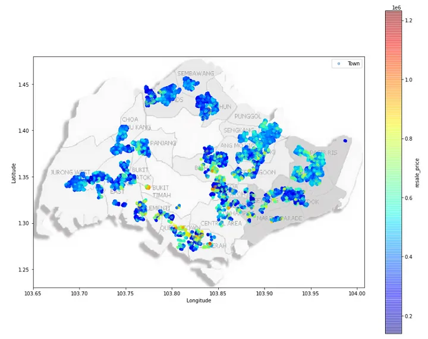
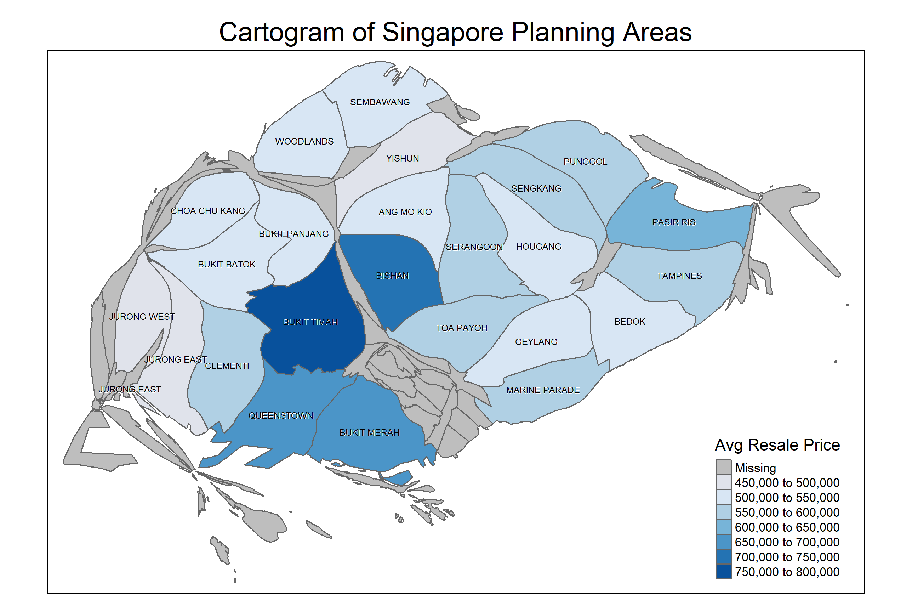

```{r}
#| label: setup
#| include: false

library(knitr)
```


# Introduction
Housing Development Board (HDB) flats in Singapore are a significant aspect of the nation’s housing market, providing affordable housing options to the majority of Singaporeans. The fluctuation of HDB prices can impact a wide range of socio-economic factors, including affordability, household wealth, and overall economic stability. The average resale price of HDB flats has seen considerable variation, influenced by factors such as government policies, economic conditions, and demographic shifts.[^Goh-Housing_Prices_2020] However, recent trends indicate a steady rise in prices due to increased demand and limited supply.[^Tan-HDB_Price_Trends_2021] Consequently, understanding the factors driving these price changes is crucial for policy-making and market forecasting.

[^Goh-Housing_Prices_2020]:S. Goh et al., “Determinants of Housing Prices: Evidence from Singapore’s HDB Market,” Journal of Housing Economics, vol. 50, pp. 101-115, 2020
[^Tan-HDB_Price_Trends_2021]:M. Tan et al., “Trends in HDB Resale Prices: An Analytical Review,” Urban Studies Journal, vol. 58, no. 2, pp. 300-315, 2021

Given the importance of housing affordability to Singapore’s socio-economic landscape, it is essential to communicate the dynamics of HDB prices clearly. In this project, we built on a comprehensive analysis of HDB resale price published by Medium (@fig-original) [^Chan_Understanding_HDB_Prices_2020].

[^Chan_Understanding_HDB_Prices_2020]: <https://towardsdatascience.com/understanding-and-predicting-resale-hdb-flat-prices-in-singapore-1853ec7069b0>

# Previous Visualization

```{r}
#| label: fig-original
#| fig-cap: "Geographical Price Heatmap of Resale Flats."
#| out-width: 100%


```

# Strengths

+ Clear Data Visualization: The heat map design effectively conveys a high information content.

+ Color Gradient: The use of a continuous color gradient helps in visualizing the variations in resale prices across different regions, making the data more comprehensible.

+ Geographical Context: The inclusion of geographical labels for towns and regions provides valuable contextual information, helping users understand the spatial distribution of the data.

+ Spatial Clarity: The map maintains spatial clarity by effectively distinguishing between different regions and towns, which helps users easily identify areas of interest.

+ Visual Appeal: The overall visual design of the heat map is aesthetically pleasing, which can engage viewers and encourage a deeper exploration of the data.


# Suggested Improvements

+ Enhance Map Labels: Increase the contrast and size of the map labels for towns and regions to ensure they are easily readable, even when overlaid with the heat map.

+ Address Color Overlap: In densely populated areas, reduce color overlap by using distinct color boundaries to better differentiate specific price variations.

+ Refine Scale and Range: Improve the color scale's resolution to capture subtle price variations more accurately, preventing the data from appearing oversimplified.


# Implementation


## Data
Resale flat prices based on registration date from Jan-2017 onwards[^resale_flat_price_2024].

*   Data will be processed to include only the past 3 years (June 2021 - May 2024), so as to generate a more relevant picture of the current trend.

[^resale_flat_price_2024]: <https://beta.data.gov.sg/collections/189/datasets/d_8b84c4ee58e3cfc0ece0d773c8ca6abc/view>


## Software

We used the Quarto publication framework and the R programming language, along with the following third-party packages:

*   *sf* for handling and analyzing spatial data in simple feature format, making it easy to work with geographic information.
*   *tmap* for thematic mapping, offering tools to create interactive and static maps with a range of customization options.
*   *tidyverse*, a collection of R packages designed for data science, including ggplot2 and dplyr
*   *cartogram* for creating cartograms, which are maps that represent data by distorting the geometry of spatial features based on the values of a particular variable.
*   *ggplot2* for visualization, using a powerful and flexible grammar of graphics to create a wide variety of static and dynamic plots.
*   *dplyr* for data manipulation and transformation, providing a set of intuitive functions for filtering, summarizing, and modifying data frames.
*   *repr* for controlling and customizing the representation of objects in various formats, enhancing the display of outputs.
*   *viridis* for color scales, providing perceptually uniform color maps for better visualization and interpretation of data.
*   *RColorBrewer* for creating color palettes, offering a collection of color schemes that are particularly useful for thematic mapping and data visualization.


# Improved Visualization

```{r}
#| label: fig-cartogram
#| fig-cap: "Cartogram of HDB resale pricing in Singapore"
#| fig-width: 6.0
#| fig-height: 5.8
#| out-width: 100%


```

# Conclusion

In conclusion, our project demonstrates the effectiveness of data visualization techniques in understanding and communicating the dynamics of HDB resale prices in Singapore. By leveraging spatial data analysis and various visualization tools, we provided a clear and comprehensive view of price variations across different regions. Our improved visualization addresses key issues identified in previous work, enhancing the readability and interpretability of the data. As HDB prices continue to evolve, ongoing analysis and visualization will remain essential in capturing and responding to these changes effectively

